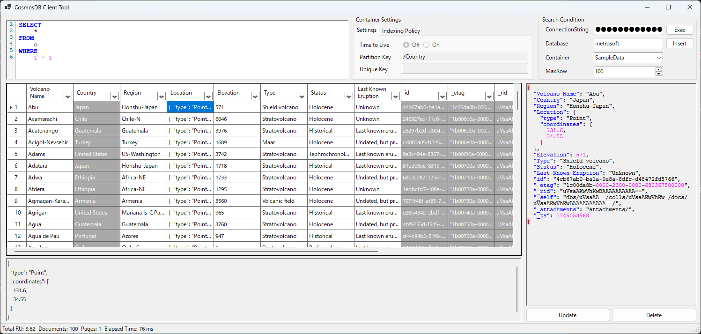

# CosmosDB Client

DBA application for managing and querying Azure Cosmos DB data.

## Features

### Database Connection
- Connect to Azure Cosmos DB using connection string
- Support for multiple databases and containers
- Container existence validation
- Container settings display (partition key, unique key, TTL settings, index settings)

### Data Querying
- SQL query execution with syntax highlighting
- Maximum item count configuration with paging feature

### Data Operations
- **Query**: Execute SQL queries against Cosmos DB containers
- **Insert**: Add new documents with JSON editor and automatic ID generation
- **Update**: Modify existing documents with upsert functionality
- **Delete**: Remove documents with confirmation dialog

### Data Display
- DataGridView for query results
- JSON viewer with syntax highlighting
- System columns automatically positioned at end
- Performance metrics display (request charge, document count, execution time)

## Configuration

Configuration in `appsettings.json`:
- ConnectionString: Azure Cosmos DB connection string
- DatabaseName: Target database name
- ContainerName: Target container name  
- MaxItemCount: Maximum query result count (default: 100)

## Technical Stack

- .NET 10.0 Windows Forms
- Azure Cosmos DB SDK
- FastColoredTextBox for syntax highlighting
- Advanced DataGridView for data display
